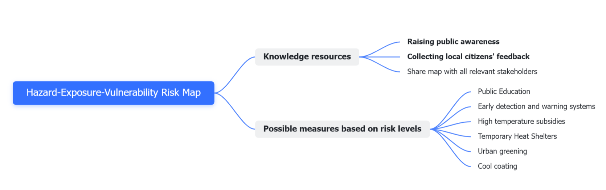

```{r setup, include=FALSE,echo=FALSE}
options(htmltools.dir.version = FALSE)
library(dplyr)
library(readr)
library(readxl)
library(knitr)
options(repos = c(CRAN = "https://cloud.r-project.org"))
install.packages("xaringanthemer")
install.packages("countdown")
install.packages("RefManageR")
```

```{r xaringan-themer, include=FALSE, warning=FALSE}
library(xaringanthemer)
style_mono_accent(
  base_color = "#47B5A4",
  header_font_google = google_font("Josefin Sans"),
  text_font_google   = google_font("Montserrat", "300", "300i"),
  code_font_google   = google_font("Fira Mono")
)

```

```{r xaringan-all, echo=FALSE, warning=FALSE}
library(countdown)
library(xaringan)
library(xaringanExtra)
hook_source <- knitr::knit_hooks$get('source')
knitr::knit_hooks$set(source = function(x, options) {
  x <- stringr::str_replace(x, "^[[:blank:]]?([^*].+?)[[:blank:]]*#<<[[:blank:]]*$", "*\\1")
  hook_source(x, options)
})
xaringanExtra::use_broadcast()
xaringanExtra::use_freezeframe()
xaringanExtra::use_scribble()
xaringanExtra::use_search(show_icon = TRUE, auto_search	=FALSE)
xaringanExtra::use_freezeframe()
xaringanExtra::use_clipboard()
xaringanExtra::use_tile_view()
xaringanExtra::use_panelset()
xaringanExtra::use_editable(expires = 1)
xaringanExtra::use_fit_screen()
xaringanExtra::use_extra_styles(
  hover_code_line = TRUE,         
  mute_unhighlighted_code = TRUE  
)
```

```{r, echo=FALSE, message=FALSE, warning=FALSE, include=FALSE}
library(RefManageR)
BibOptions(check.entries = FALSE,
           bib.style = "authoryear",
           cite.style = "authoryear",
           style = "markdown",
           hyperlink = TRUE,
           dashed = FALSE,
           no.print.fields=c("url", "urldate", "issn"))
myBib <- ReadBib("./references.bib", check = FALSE)

```

class: center, title-slide, middle

background-image: url("source/cover3.jpg")
background-size: cover
background-position: center


# Thermal Environment in Hongkong
## CASA0023 Group Project
### Snow White and the 5 Knights

### `r format(Sys.time(), "%d/%m/%Y")`

---
class: inverse, center, middle

# Problem: Context & Background

---
class: center, middle

## Hongkong suffers from heat island problems


.pull-left[
```{r echo=FALSE, out.width='120%', fig.align='left'}

```
Annual mean temperature recorded at Hong Kong (1885-2023)  
Source: [Hong Kong Observatory](https://www.hko.gov.hk/en/climate_change/obs_hk_temp.htm) 
]
.pull-right[
```{r echo=FALSE, out.width='120%', fig.align='left'}
knitr::include_graphics("source/Figure2.png")
```
Map of evening temperature variation from urban to suburban areas of Hong Kong
Source: [Hong Kong Observatory](https://www.hko.gov.hk/en/climate_change/urbanization.htm)
]


---
# Location


- Hong Kong is located in southern China, east of the Pearl River Estuary

- **One of the most densely populated** cities in the world, with an **urbanization rate of 100%**

```{r echo=FALSE, out.width='50%', fig.align='center'}
knitr::include_graphics("source/Figure3.png")
```

Source: [reachtoteachrecruiting.com](https://www.reachtoteachrecruiting.com/map-of-hong-kong)

---
# Problem Statement

- Hong Kong exhibits a pronounced and intense urban heat island effect, primarily **concentrated in highly urbanized areas**.

- The urban heat island effect is closely associated with the **socioeconomic status of communities**, with **poorer neighbourhoods** experiencing **higher temperatures**.

.pull-left[
```{r echo=FALSE, out.width='80%', fig.align='center'}

```
Spatial distribution of Surface Urban Heat Island (SUHI) areas in Hong Kong
]
.pull-right[
```{r echo=FALSE, out.width='77%', fig.align='center'}
knitr::include_graphics("source/Figure5.png")
```
Spatial cluster inhabited by individuals with incomes below $4,000
]
Source: `r Citet(myBib, "Wong2016")`

---
# Problem Statement

```{r echo=FALSE, out.width='40%', fig.align='center'}

```

Hong Kong has **125,100 millionaires** and **1.6 million in poverty**, with  **220,000 living in substandard conditions**. 

Rising temperatures affect the city's poorest the most, with **70%** of surveyed residents in small spaces facing **daily heat issues like heatstroke**. Additionally, **60%** deal with **bad ventilation**, and **20% don't have windows**.

Source: `r Citet(myBib, "OHK2022")`


---
#Impact
.panelset[
.panel[.panel-name[Social]

- **Health Risks**
  - Elevated temperatures → Increased **heat-related illnesses** (heatstroke, etc.)
  - Every **1°C increase above 29°C** → **4.5% rise in hospital admissions**
  - Linked to higher **mortality/morbidity** from heart, respiratory, kidney diseases, and mental health issues 

- **Decreased Comfort & Quality of Life**
  - High temperatures **reduce outdoor comfort**
  - Impacts **residents' life quality** and **outdoor workers' conditions**
  
Source: `r Citet(myBib, "Tong2021")`
]

.panel[.panel-name[Environmental]

- **Increased Energy Consumption**
  - UHI raises temperatures, boosting **AC and cooling device usage**
  - Each **1°F rise** → **Cooling demand up by 1.5% to 2%**
  - Results in a **5-10% increase in electricity needs** 

- **Worsened Air Pollution & Greenhouse Gas Emissions**
  - More energy use → **Higher air pollution and greenhouse gas emissions**
  - Emissions worsen UHI, impacting urban sustainability and health

Source: `r Citet(myBib, "Rinkesh2016")`
]

.panel[.panel-name[Economic]

- **Increased Economic Burden**

  - Higher energy needs for cooling → **Increased electricity bills** for households and businesses
  - Increased **financial burden on Governments** to manage public health issues as a result of adapting to urban heating 
  
Source: `r Citet(myBib, "HongKong2021")`
]
]

---
class: inverse, center, middle

# Policy: Global & Hong Kong

---

## Global Policies about Urban Heat Island

1. United Nations' The New Urban Agenda

2. Beating the Heat: A Sustainable Cooling Handbook for Cites

3. The Cool Cities Network

4. The Paris Agreement

5. Sustainable Development Goals

```{r echo=FALSE, out.width='100%', fig.align='center'}
knitr::include_graphics("source/empty.png")
```


```{r echo=FALSE, out.width='100%', fig.align='center'}

```

---

## Current Policy: Hong Kong Climate Action Blueprint 2050

- design standards related to public infrastructure and government buildings
- green building design and sustainable built environment
- urban forestry and increasing afforestation

```{r echo=FALSE, out.width='50%', fig.align='center'}

```
Hong Kong Cycling Park

Source: `r Citet(myBib, "EEB2023")`

---

## Current Measures to Urban Heat

.pull-left[
**Coping with urban heat in Hong Kong**
- night shelters
- more relief measures for residents in inadequate housing
- urban greening in public works
- greenery and environmentally friendly designs

**Overseas experience in tackling urban heat**
- specific community/vulnerable groups
- heat relief measures/shelters in public places
- greenery in urban building design
- research collaboration
]
.pull-right[

```{r echo=FALSE, out.width='100%', fig.align='center'}

```
```{rr echo=FALSE, out.width='100%', fig.align='center'}
knitr::include_graphics("source/empty.png")
```

Mearsures to tackle urban heat

Source: `r Citet(myBib, "TLC2020")`
]
---
class: inverse, center, middle

# Policy: Case Study

---
# Case Study

.pull-left[
###"Cool Neighborhoods NYC" 
It is an innovative, citywide effort initiated by New York City to tackle extreme heat, which contributes to more deaths annually than all other natural disasters combined. The investment budget for the programme is $106 million.

The Cool Neighborhoods NYC project identifies heat vulnerability through the development and use of the Heat Vulnerability Index (HVI), a composite index that combines a variety of physical and social indicators that affect a community's heat vulnerability.
]
.pull-right[

]
Source: `r Citet(myBib, "PGSD2007")`
---
# Case Study

.pull-left[
Three main strategies:

**Heat Mitigation Strategies**
- Tree Plantings（$82 million）
- Cool Roofs（over $4 million）
- Cool Pavements

**Heat Adaptation Strategies**
- Climate Risk Training for Home Health Aides
- Be a Buddy NYC（A $930,000 community-led preparedness model）
- Partnerships for Preventative Messaging

**Monitoring Strategies**
- Innovative Data Collection（A $300,000 investment）
]

.pull-right[

]

---
# Case Study

## Economic and Social Benefits

The initiative is expected to yield significant economic and social benefits, including:

* Reduced **energy consumption and costs** due to increased canopy cover and cool roofs, leading to an annual **$1 million** in energy cost savings.

* Enhanced public health outcomes through targeted interventions and educational programs, aiming to decrease **heat-related illnesses and mortality**.

* Improved **environmental quality and biodiversity** through increased green space and urban tree canopies.

* Fostered **community resilience and social cohesion** by empowering community organizations and volunteers to support vulnerable populations during heat emergencies.

---
class: inverse, center, middle

# Methodology

---
#Methodology-1: 
##The IPCCʼs Conceptual Framework for Risk Assessment
.pull-left[
* Measuring the potential for adverse consequences from climate change.

* Emphasising the connection between climate change events and its consequences for human or ecological systems.

* Improving the ability for decision-makers to understand and manage climate change risk. 

Source: `r Citet(myBib, "IPCC2020")`
]

.pull-right[

Source: `r Citet(myBib, "CC2014")`
]

---
#Methodology-1: The Index Definition

.pull-left[
* **Hazard**:  refers to the climate-related physical events or trends or their physical impacts.
* **Heat Hazard**: The spatial distribution of extreme heat events.

* **Exposure**: refers to the susceptibility degree to adverse effects related to climate change events, including sensitivity and adaptive capacity. 
* **Heat Exposure**: The spatial distribution of population density.

Source:`r Citet(myBib, "IPCC2020")`;`r Citet(myBib, "wangHealthintegratedHeatRisk2023")`;`r Citet(myBib, "huaSpatiotemporalAssessmentExtreme2021")` and `r Citet(myBib, "wuSpatiallyExplicitAssessment2024")`
]

.pull-right[
* **Vulnerability**: 
refers to people, livelihoods, species, ecosystems or other matters present in the environment that may be adversely affected.
* **Heat Vulnerability**: 
Measuring vulnerable populations potentially affected by extreme heat events.


]


---
# Methodology-2: Heat Risk Assessment Framework
```{r echo=FALSE, out.width='150%', fig.align='center'}

```

Source: `r Citet(myBib, "PGSD2007")`

---
# Methodology-2: Remote Sensing Data
.panelset[
.panel[.panel-name[Heat Hazard: LTS]

- Data Source: **USGS Landsat 8 Level 2, Collection 2, Tier 1**
  - Thermal Infrared Sensor (TIRS) with **thermal bands**.
  - Providing data after **radiometric correction and atmospheric correction**. 
  - Contains surface reflectance and **land surface temperature (LST:SR_B10)**.
 
- **Data Information**
  - Spatial Resolution: 30 metres
  - Temporal  Resolution : 16 days
  - Cost : Free
  - Processing：Band Calculation
    
Source: [Earth Engine Data Catalog: Landsat 8](https://developers.google.com/earth-engine/datasets/catalog/LANDSAT_LC08_C02_T1_L2#descriptio)
]

.panel[.panel-name[Heat Exposure: Population Distribution ]

- Data Source: **WorldPop Global Project Population Data**
  -  **Ready-to-use product**
  - A top-down method: Based on an administrative unit-based census, **an improved "random forest" model** is use. [(Stevens et al., 2015)](https://journals.plos.org/plosone/article?id=10.1371/journal.pone.0107042#sec016)
  - Providing **spatial flexibility** compared to population data collected by larger administrative units [(WorldPop, 2024)](https://www.worldpop.org/methods/top_down_constrained_vs_unconstrained/)

- **Data Information**
  - Spatial Resolution: 92.77 metres
  - Temporal  Range :  Annually
  - Cost : Free
  - Processing：According to the method provided by Zhang, Fan and Xu (2024), remote sensing data can be corrected based on the census dataset.

Source: [Earth Engine Data Catalog: WorldPop Global Project Population Data](https://developers.google.com/earth-engine/datasets/catalog/WorldPop_GP_100m_pop)
]
]

---
class: inverse, center, middle

# Action plan

---
# General Action plan
### Hazard-Exposure-Vulnerability Risk Map

```{r echo=FALSE, out.width='150%', fig.align='center'}

```

---
# Relevant stakeholders

.pull-left[
* **Government**: Governments are primarily responsible for urban planning and management, such as urban planning department and environmental department. 
* **Academic institution**: Academic institutions are responsible for conducting research on the heat island effect, developing related technologies and methods.

* **Industry and enterprises**: Enterprises have a responsibility to reduce carbon emissions, because they generate a large amount of heat and greenhouse gas emissions in their operations

Source:`r Citet(myBib, "barth2011idea")`;`r Citet(myBib, "encyclopedia")`
]

.pull-right[
* **Local community and citizens**: Residents are directly affected by the urban heat island effect. Therefore, they should provide more suggestions and feedback.

* **Environmental protection organization**: We should share our maps with environmental organizations to gather suggestions on facing climate change.

]


---
# Possible measures

**Hazard-Exposure-Vulnerability Risk Level**

.panelset[
.panel[.panel-name[Low]

- **Public Education**
  - Causes and risks of urban heat islands
- **Early detection and warning systems**
  - Installation of temperature sensors and establishment of an early warning information platform
  - When a warning is triggered, this system can send out the warning message on time.


Source: [Hong Kong Legislative Council](https://www.legco.gov.hk/research-publications/english/essentials-2021ise04-measures-to-tackle-urban-heat.htm)
]

.panel[.panel-name[Medium]

- Public Education
- Early detection and warning systems
- **High temperature subsidies**
  - Vulnerable groups are more exposed to hot weather and the urban heat island effect partly because they cannot afford to pay high electricity bills.

- **Temporary Heat Shelters**
  - By providing *night shelters*, governments can help urban residents cope with the problems caused by hot weather and the urban heat island effect.


Source: [Hong Kong Home Affairs Department](https://www.had.gov.hk/en/public_services/emergency_services/emergency.htm)
]

.panel[.panel-name[High]

- Public Education
- Early detection and warning systems
- High temperature subsidies
- Temporary Heat Shelters
- **Urban greening**
  -	Urban surface temperatures can be reduced and the heat island effect minimized by increasing vegetation cover and green space in cities.

- **Cool coating**
  -	Cooling coatings provide better thermal comfort for pedestrians.


  
Source: `r Citet(myBib, "donthuDynamicsCoolSurface2024")`

]
]


---
# References

```{r bibliography, results='asis', echo=FALSE, warning=FALSE}
PrintBibliography(myBib
                  , start = 1, end = 6
                  )
```

---

# References (cont.)

```{r bibliography2, results='asis', echo=FALSE, warning=FALSE}
PrintBibliography(myBib
                  , start = 7, end = 13
                  )
```
---

# References (cont.)

```{r bibliography3, results='asis', echo=FALSE, warning=FALSE}
PrintBibliography(myBib
                  , start = 14, end = 20
                  )
```
